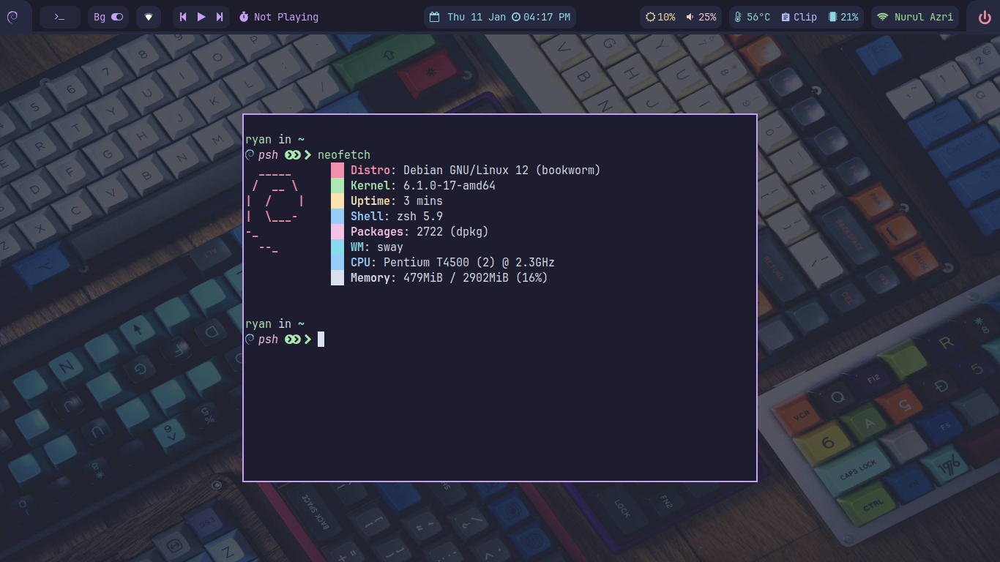
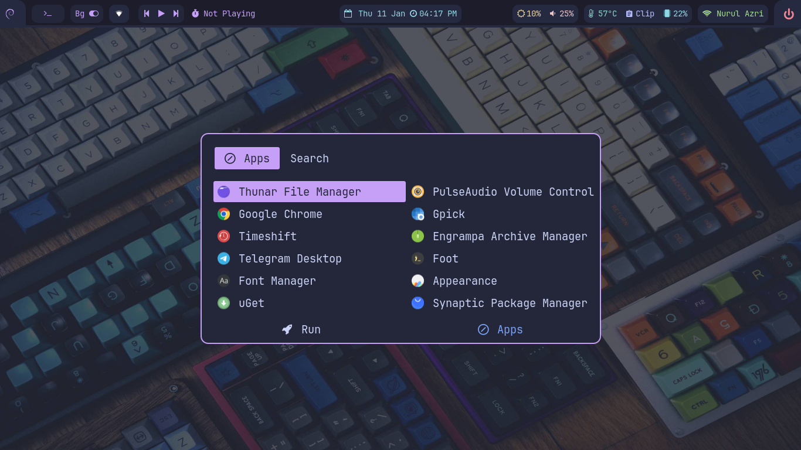
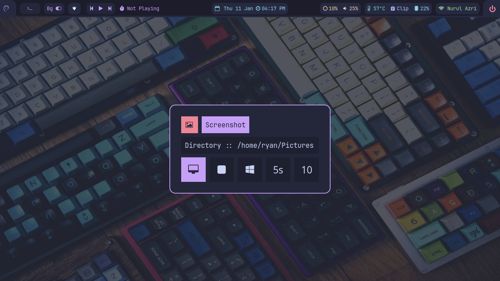
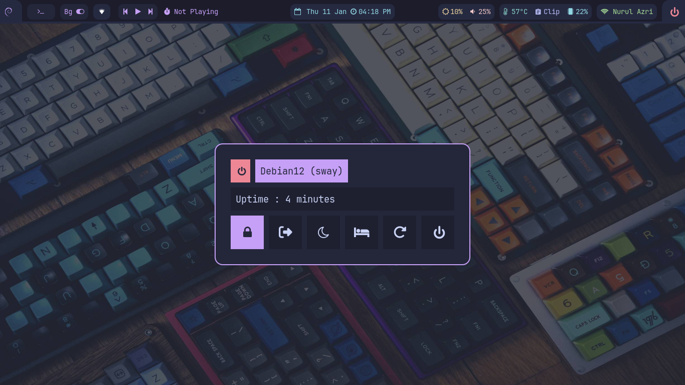
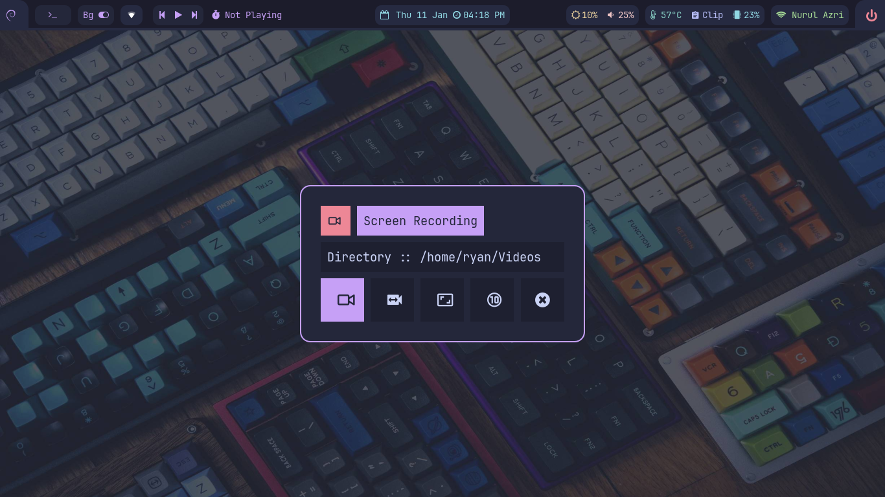

# Sway-WM Dotfiles

## 🔥 Information

|    Distro    |            [Archlinux](https://archlinux.org/)-[Debian 12](https://debian.org/)             |
| :----------: | :-----------------------------------------------------------------------------------------: |
|      WM      |                                 [Sway](https://swaywm.org/)                                 |
|   Terminal   |                           [Foot](https://codeberg.org/dnkl/foot)                            |
|    Shell     |        [archlinux+zsh+zap](https://www.zapzsh.org/)-[starship](https://starship.rs/)        |
|    Shell     | [debian12+zsh+ohmyzsh](https://github.com/ohmyzsh/ohmyzsh)-[starship](https://starship.rs/) |
|   Launcher   |                        [Rofi Wayland](https://github.com/lbonn/rofi)                        |
|  Clipboard   |                       [Cliphist](https://github.com/sentriz/cliphist)                       |
| File Manager |                                           thunar                                            |

## 🖼️ Gallery












## 💣 Setup Installation

1.- <b>First clone the repository</b>

```sh
https://github.com/hidayry/swaywm-dotfiles.git
```

2.- <b>Copy config :</b>

- **⚠️ WARNING: Configuration files may be overrided,please backup your config**

```sh
cd swaywm-dotfiles
cp -r .config/* ~/.config/
cp -r home/* ~/
```

3.- <b>Install Dependencies</b>

**_Dependencies Archlinux:_**

```sh
sudo pacman -S --needed sway swaybg waybar jq findutils mpd ncmpcpp swayidle wf-recorder dmenu brightnessctl mako cliphist grim slurp pamixer polkit-gnome starship xdg-user-dirs xdg-utils gvfs gvfs-mtp gvfs-nfs wl-clipboard playerctl foot network-manager-applet grimshot yad xdg-desktop-portal-wlr
```

- **aur-packages**

```sh
yay -S --needed tela-circle-icon-theme-manjaro tokyonight-gtk-theme-git wl-clipboard-history-git ttf-jetbrains-mono-nerd mpdris2 rofi-lbonn-wayland swaylock-effects nwg-look
```

- **zap zsh**

```sh
zsh <(curl -s https://raw.githubusercontent.com/zap-zsh/zap/master/install.zsh) --branch release-v1
```

for zap zsh in this [link](https://github.com/zap-zsh/zap)

**_Dependencies debian12:_**

cause polkit-gnome crash in debian 12, i use lxpolkit

```sh
sudo apt install sway lxpolkit yad jq findutils pamixer brightnessctl wf-recorder grim slurp grimshot wl-clipboard swayidle waybar mako-notifier mpdris2 mpd ncmpcpp suckless-tools xdg-user-dirs playerctl foot network-manager-gnome xdg-utils papirus-icon-theme libplayerctl-dev gir1.2-playerctl-2.0 zsh zsh-autosuggestions zsh-syntax-highlighting xdg-desktop-portal-wlr
```

**for other debian12 build from source**

- [tokyonight-gtk-theme](https://github.com/Fausto-Korpsvart/Tokyo-Night-GTK-Theme)

- [starship](https://starship.rs/)

- [rofi-lbonn-wayland](https://github.com/lbonn/rofi)

- [swaylock-effects](https://github.com/mortie/swaylock-effects)

- [ttf-jetbrains-mono-nerd](https://github.com/ryanoasis/nerd-fonts)

<table align="center">
   <tr>
      <th align="center">
      </th>
   </tr>
   <tr>
      <td align="center">

    💻 Dotfiles Configured at 1360x768 with 96 DPI on 1 monitor

   </tr>
   </table>
